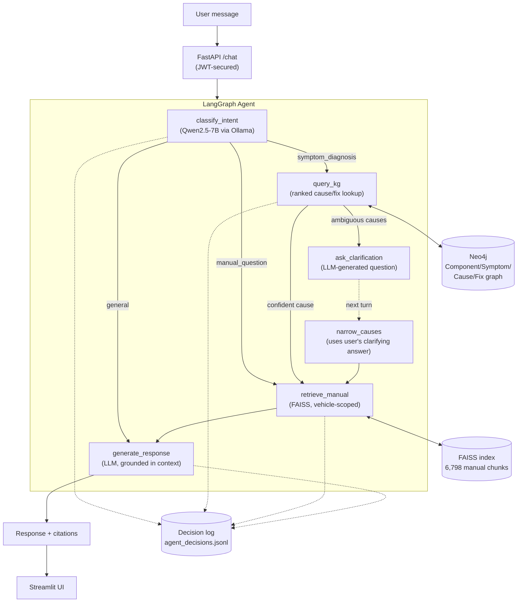

# 🚗 AutoMind — Agentic In-Vehicle AI Copilot

AutoMind is an agentic AI assistant that helps drivers understand and diagnose vehicle issues by combining **retrieval-augmented generation (RAG)** over real owner's manuals with a **knowledge-graph reasoning engine** for fault diagnosis — orchestrated by a **LangGraph** agent that decides, turn by turn, whether to search a manual, query the graph, or ask a clarifying question before answering.

Built end-to-end: PDF ingestion → embeddings → FAISS → Neo4j knowledge graph → LangGraph agent → FastAPI (JWT-secured) → Streamlit frontend → Docker.

---

## The problem

Owner's manuals contain the right information, but almost nobody reads them when a warning light comes on — they panic, guess, or go straight to a mechanic for something they could've diagnosed in 30 seconds. AutoMind bridges that gap: it reasons over manual text *and* a structured fault-diagnosis graph, and — critically — it asks a clarifying question instead of guessing when a symptom has multiple plausible causes.

**Example interaction:**
```
User: My check engine light is on and the car is misfiring
Agent: Does the misfire happen more at idle or under acceleration, and do you
       notice any unusual engine sounds?
User: Mostly at idle, rough idle
Agent: This points to a faulty spark plug (the most common cause of rough-idle
       misfires). Replace the spark plug — see page 441 of your manual. If
       that doesn't resolve it, the ignition coil or oxygen sensor are the
       next things to check.
```

---

## Architecture



**Why this design:** a pure RAG chatbot can retrieve relevant text but can't *reason* about which of several plausible causes is most likely, or know when it needs more information before answering. The knowledge graph adds structured, ranked reasoning; the agent layer adds the judgment to ask before guessing.

---

## Tech stack

| Layer | Technology |
|---|---|
| LLM | Qwen2.5-7B, served locally via Ollama (zero API cost) |
| Embeddings | Sentence-Transformers (`all-MiniLM-L6-v2`) |
| Vector search | FAISS (`IndexFlatIP`, cosine similarity) |
| Knowledge graph | Neo4j (Component → Symptom → Cause → Fix schema) |
| Agent orchestration | LangGraph |
| Backend | FastAPI + JWT auth |
| Frontend | Streamlit |
| Containerization | Docker Compose (Neo4j + API + frontend; Ollama runs on host for GPU access) |

---

## Data

Four real OEM owner's manuals, parsed and chunked (6,798 chunks total):

| Manual | Pages | Chunks |
|---|---|---|
| Honda Civic Sedan (2025) | 736 | 1,020 |
| Toyota Corolla (2025) | 468 | 879 |
| Tata Harrier BS6 (2026) | 362 | 606 |
| Maruti Suzuki Jimny (NEXA) | 479 | 4,293 |

Knowledge graph: 6 vehicle systems, 21 components, 11 symptoms, 22 causes, 22 fixes, spanning both ICE and EV fault domains.

---

## Evaluation

Rather than relying on anecdotal testing, `evaluation/eval_script.py` measures the agent against two held-out test sets:

| Metric | Result |
|---|---|
| Symptom-classification accuracy (13 paraphrased test cases) | **84.6%** (11/13) |
| Avg. classification latency (Qwen2.5-7B, local GPU) | **~4.7s** |
| Vehicle-scoped retrieval precision (8 test cases) | **50%** — remaining cases correctly triggered a fallback-to-full-corpus safeguard rather than returning a weak match |

The two misclassifications were genuinely ambiguous phrasings (e.g. "steam coming from the hood" without an explicit temperature cue) — documented in `evaluation/eval_report.json` rather than cherry-picked away.

Run it yourself:
```bash
python -m evaluation.eval_script
```

---

## Observability

Every agent decision (intent classification, graph query, clarification, retrieval, response generation) is logged as structured JSON with timestamps and latency to `logs/agent_decisions.jsonl` — enough to trace exactly why the agent routed a given way for any session, without needing a full tracing platform.

```bash
python -m src.agent.view_logs --session <id>
```

---

## Running it locally

**Prerequisites:** Docker Desktop, [Ollama](https://ollama.com) with `qwen2.5:7b` pulled, Python 3.11+.

```bash
# 1. Ingest manuals (drop PDFs into data/manuals/ first)
python -m src.ingestion.pdf_parser
python -m src.ingestion.chunker
python -m src.rag.vector_store

# 2. Start Ollama (separate terminal)
ollama serve

# 3. Build and start the full stack
docker compose -f docker/docker-compose.yml up -d --build

# 4. Seed the knowledge graph (fresh Neo4j container = empty graph)
python -m src.knowledge_graph.kg_builder
```

Open **http://localhost:8501** — log in with `demo` / `automind123`.

---

## Known limitations

Documented honestly rather than discovered by someone else:

- **Vehicle selection is session-level, not per-message.** If a user mentions a different vehicle mid-conversation, the agent doesn't detect the switch — the manual filter stays locked to whatever was selected at login. This mirrors how most real in-vehicle assistants work (paired to one car per session).
- **Session state is in-memory**, not persisted to Redis/a database — conversations reset on server restart and won't scale across multiple API workers. Fine for a demo; Redis would be the production upgrade.
- **No automated test suite** (pytest) yet — testing has been done via the evaluation script and manual/live verification.

---

## What I'd build next

- Cross-encoder reranking after FAISS retrieval for better precision
- A guardrail/self-check node that verifies safety-critical answers (brakes, overheating) actually match the retrieved context before returning them
- RAGAS-based evaluation for a more standardized RAG quality benchmark
- Redis-backed sessions for multi-worker deployment
